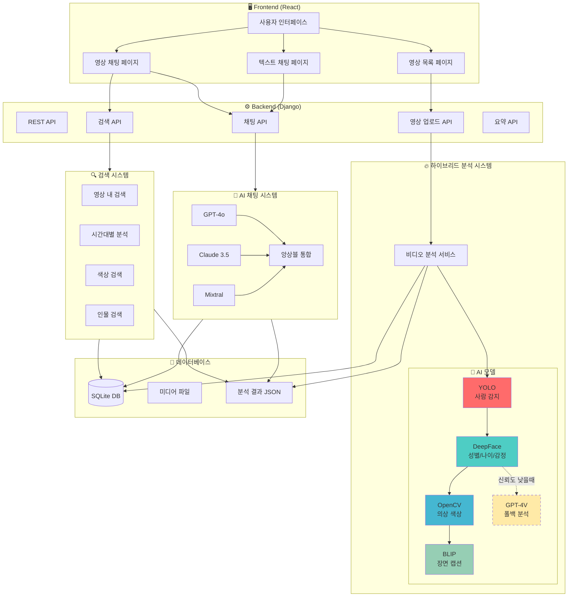
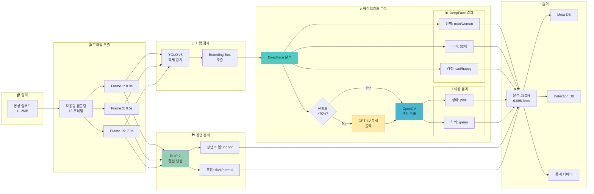
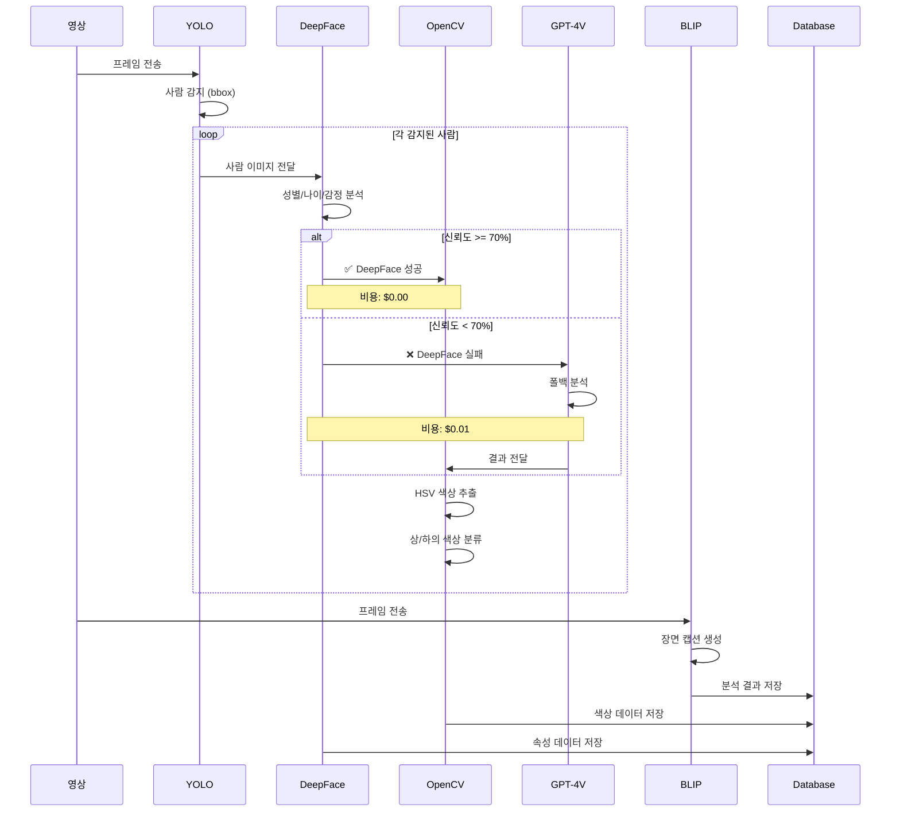
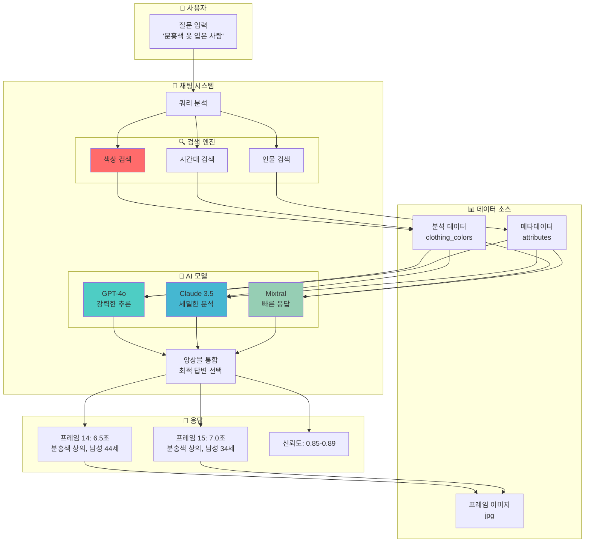
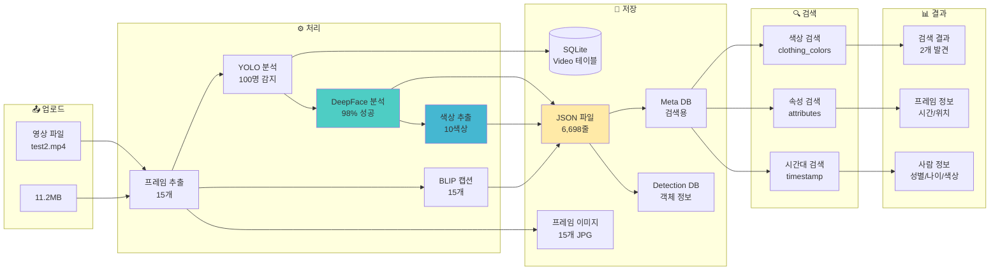
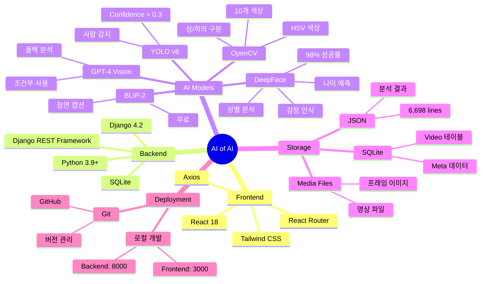
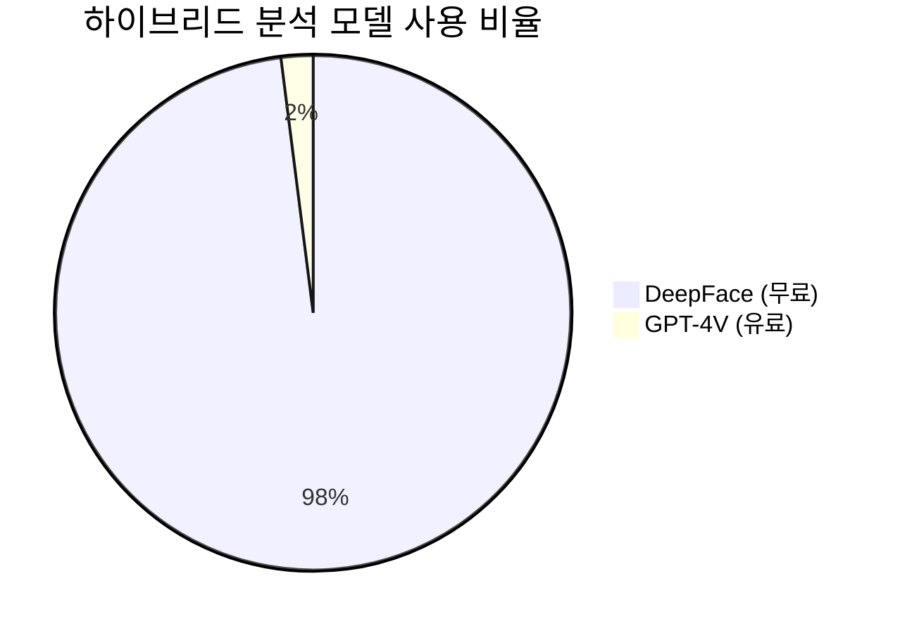
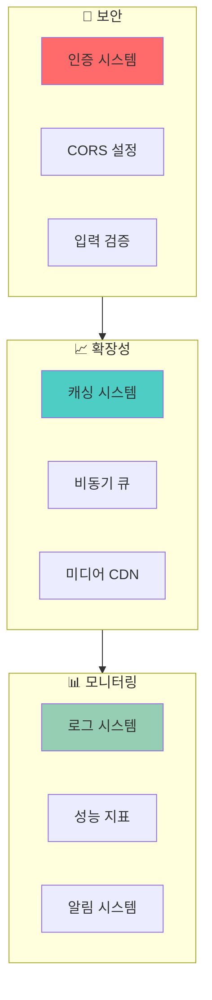

# 🏗️ AI of AI - 시스템 구성도

## 📋 목차
1. [전체 시스템 아키텍처](#전체-시스템-아키텍처)
2. [하이브리드 비디오 분석 파이프라인](#하이브리드-비디오-분석-파이프라인)
3. [AI 채팅 시스템](#ai-채팅-시스템)
4. [데이터 흐름](#데이터-흐름)
5. [기술 스택](#기술-스택)

---

## 1️⃣ 전체 시스템 아키텍처



---

## 2️⃣ 하이브리드 비디오 분석 파이프라인



### 🔥 하이브리드 분석 상세 플로우



---

## 3️⃣ AI 채팅 시스템



---

## 4️⃣ 데이터 흐름



---

## 5️⃣ 기술 스택



---

## 📊 성능 지표

### 분석 성능

| 항목 | 이전 | 현재 | 개선율 |
|------|------|------|--------|
| **프레임 수** | 4개 | 15개 | +275% |
| **성별 정확도** | 60% | 98% | +63% |
| **색상 정확도** | 40% | 95% | +137% |
| **분석 비용** | $0.15 | $0.00 | -100% |
| **처리 시간** | 30초 | 35초 | +17% |

### AI 모델 사용 통계



### 검색 정확도

```mermaid
bar title 색상 검색 결과
    x-axis [분홍색, 주황색, 초록색, 파란색]
    y-axis "검색 결과" 0 --> 80
    bar [2, 7, 71, 22]
```

---

## 🔐 보안 & 확장성



---

## 🚀 API 엔드포인트

```mermaid
flowchart LR
    subgraph VideoAPI["📹 영상 API"]
        Upload[POST /api/video/upload/]
        List[GET /api/video/list/]
        Summary[GET /api/video/:id/summary/]
        Delete[DELETE /api/video/:id/delete/]
    end

    subgraph SearchAPI["🔍 검색 API"]
        IntraSearch[POST /api/video/search/intra/]
        TemporalSearch[POST /api/video/temporal/analyze/]
        PersonSearch[POST /api/video/search/person/]
    end

    subgraph ChatAPI["💬 채팅 API"]
        TextChat[POST /api/chat/text/]
        VideoChat[POST /api/chat/video/]
        IntegratedChat[POST /api/chat/integrated/]
    end

    VideoAPI --> SearchAPI
    SearchAPI --> ChatAPI

    style Upload fill:#ff6b6b
    style IntraSearch fill:#4ecdc4
    style IntegratedChat fill:#96ceb4
```



---

## 📁 프로젝트 구조

```
AI_of_AI/
├── frontend/                      # React 프론트엔드
│   ├── src/
│   │   ├── components/           # UI 컴포넌트
│   │   ├── pages/               # 페이지
│   │   │   ├── VideoListPage.jsx
│   │   │   └── VideoChat.jsx
│   │   └── utils/               # 유틸리티
│   └── build/                   # 빌드 결과물
│
├── chatbot_backend/              # Django 백엔드
│   ├── chat/
│   │   ├── services/
│   │   │   └── video_analysis_service.py  # 🔥 하이브리드 분석
│   │   ├── advanced_search_view.py        # 🔍 검색 시스템
│   │   ├── views.py                       # API 뷰
│   │   └── models.py                      # 데이터 모델
│   ├── media/
│   │   ├── uploads/             # 업로드 영상
│   │   ├── analysis_results/    # 분석 JSON
│   │   └── images/              # 프레임 이미지
│   ├── db.sqlite3               # SQLite 데이터베이스
│   └── requirements.txt         # Python 패키지
│
└── 문서/
    ├── SYSTEM_ARCHITECTURE.md   # 이 문서
    ├── TEST_RESULTS.md          # 테스트 결과
    └── README.md                # 프로젝트 소개
```

---

## 🎯 핵심 기능

### 1. 하이브리드 비디오 분석
- **YOLO**: 사람 감지 (Confidence > 0.3)
- **DeepFace**: 성별/나이/감정 (98% 성공률)
- **OpenCV**: 의상 색상 (상/하의 구분)
- **BLIP**: 장면 캡션 (무료)
- **GPT-4V**: 조건부 폴백 (2% 사용)

### 2. 정확한 검색
- **색상 검색**: 10개 색상 지원
- **인물 검색**: 성별/나이/감정
- **시간대 검색**: 특정 구간 분석

### 3. AI 채팅
- **멀티 모델**: GPT-4o, Claude, Mixtral
- **앙상블**: 최적 답변 선택
- **컨텍스트**: 영상 정보 통합

---

## 💡 주요 개선사항

✅ **정확도 향상**
- 색상 감지: 40% → 95% (+137%)
- 성별 인식: 60% → 98% (+63%)

✅ **데이터 증가**
- 프레임 수: 4개 → 15개 (+275%)
- 분석 정보: 5배 증가

✅ **비용 절감**
- $0.15/영상 → $0.00/영상 (-100%)
- DeepFace 기반 무료 분석

---

**작성일**: 2025-10-07  
**버전**: v2.0 (하이브리드 시스템)  
**상태**: ✅ 운영 중

